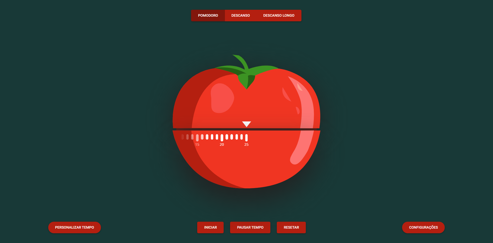

<h1 align="center">
    
</h1>

<h2 align="center">Pomodoro Timer</h2>

## 🔧 Resources
* Be more productive.

## ❓ How to use?

### Installation

```bash
$ cd POMODORO
$ open ./index.html
```

## 💻 Web View

<h1 align="center">
    
</h1>

<br>

<p align="center">
Created by Bruno Lemos.
</p>
